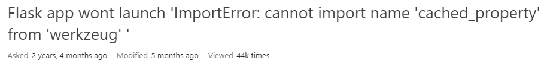
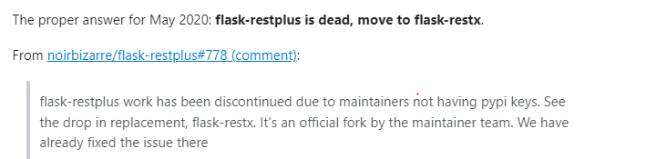

## Flask-restplus 

I tried solving the part 1 of the problem. but everytime I was running the app. It throws this error ***"'ImportError: cannot import name 'cached_property' from 'werkzeug' " ***

I tried googling this error but then I came to know that ***flask-restplus work has been discontinued due to maintainers not having pypi keys.*** 

I really tried everything to solve this error this today but unfortunately, I could not. 

Here are screenshots:

Error:

Stackoverflow suggests this: 
